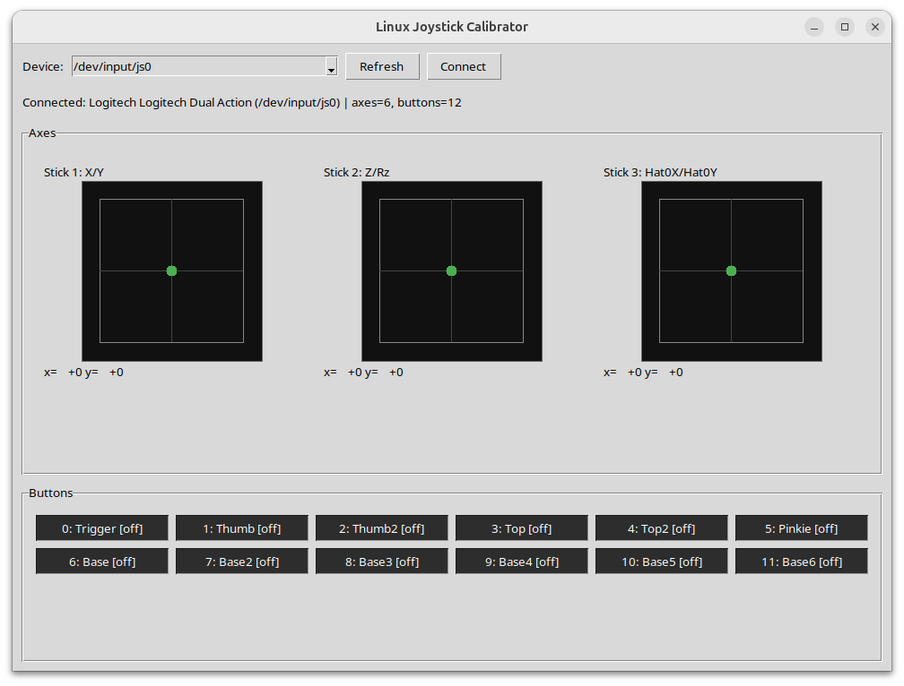

# joystick-calib


Simple Linux joystick calibration/visualization GUI using the `joydev` interface (`/dev/input/js*`).

It auto-detects available joystick devices, reads all axes and buttons, and shows live state:
- Axes are rendered as square stick boxes with realtime position markers.
- Buttons are listed with ON/off indicators.

Run:
```bash
python3 joystick_calibrator.py
```

## Windows 11 Port

For Windows, use the SDL/pygame-backed version:

Install dependency:
```bash
py -m pip install pygame
```

Run:
```bash
py joystick_calibrator_windows.py
```

Optional (connect a specific controller index):
```bash
py joystick_calibrator_windows.py --device-index 0
```
